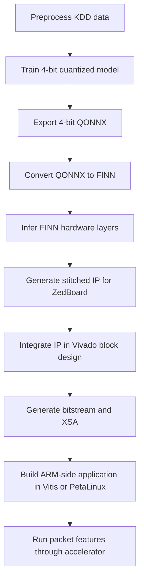

# Deployment Flow for ZedBoard

This project should use the 4-bit model for FPGA deployment. The repository now has one deployment path:

1. Train or reuse the 4-bit Brevitas model.
2. Export the 4-bit model to QONNX.
3. Convert QONNX to FINN and infer hardware layers.
4. Build FINN stitched IP for ZedBoard.
5. Integrate the stitched IP into a ZedBoard Vivado design.
6. Program the board and run software-side inference from the ARM processor.

## Why ZedBoard needs a custom flow

FINN supports full shell-integrated deployment for PYNQ boards such as Pynq-Z1 and Pynq-Z2. For arbitrary Xilinx boards, FINN generates stitched IP with AXI-stream interfaces that must be integrated manually into Vivado.

Official references:

- [FINN hardware build and deployment](https://finn.readthedocs.io/en/latest/hw_build.html)
- [FINN getting started and supported hardware](https://finn.readthedocs.io/en/latest/getting_started.html)
- [Digilent ZedBoard board page](https://digilent.com/shop/zedboard-zynq-7000-arm-fpga-soc-development-board/)

## Process Flow



## What you run in this repo

Important:

- `brevitas`, `qonnx`, and normal PyTorch training can run in your local project environment.
- `finn_prepare_4bit_deploy.py` and `finn_build_accelerator.py` need a real FINN environment.
- FINN officially recommends Docker-based execution rather than a plain local `pip install`.

### 1. Prepare the Python-side model artifacts

Run these in your project environment:

```bash
python3 preprocess.py
python3 train.py
python3 finn_prepare_4bit_deploy.py
```

This produces:

- `models/finn/nids_4bit_qonnx.onnx`
- `models/finn/nids_4bit_qonnx_clean.onnx`
- `models/finn_hw/nids_4bit_streamlined.onnx`
- `models/finn_hw/nids_4bit_ready.onnx`
- `models/finn_hw/input.npy`
- `models/finn_hw/expected_output.npy`
- `models/finn_hw/deploy_manifest.json`

### 2. Run the FINN hardware build

Do this from a proper FINN environment with Vivado available. The recommended setup is the official FINN Docker flow.

```bash
python3 finn_build_accelerator.py --board zedboard
```

This is the correct target for your board. It asks FINN for:

- estimate reports
- stitched IP
- out-of-context synthesis

For comparison, if you were targeting a supported PYNQ board, you would run:

```bash
python3 finn_build_accelerator.py --board pynq-z2
```

That path can attempt full bitfile and driver generation. ZedBoard cannot use that shortcut directly.

## What you have to do manually for ZedBoard

After FINN generates the stitched IP, your work moves into Vivado and the Zynq software toolchain.

### A. In Vivado

1. Create a ZedBoard project for part `xc7z020clg484-1`.
2. Create a block design with the Zynq Processing System.
3. Run block automation so DDR, clocks, and fixed IO are configured.
4. Add the FINN stitched IP produced by the build.
5. Connect AXI-Lite control if exposed by the FINN design.
6. Connect AXI DMA or AXI-Stream FIFO between PS memory space and the FINN accelerator.
7. Connect clocks and resets correctly.
8. Validate the design.
9. Generate the HDL wrapper and bitstream.
10. Export hardware handoff as `.xsa`.

### B. In Vitis or PetaLinux

1. Build the ZedBoard software project from the `.xsa`.
2. Write the host application that:
   - loads one 41-feature vector
   - applies the same scaler used in training
   - copies input data into DMA-accessible memory
   - starts the accelerator
   - reads back the 2-class output
3. Compare board output against `models/finn_hw/expected_output.npy`.

### C. On the board

1. Copy the bitstream and software executable.
2. Program the FPGA.
3. Run inference on known test samples first.
4. Measure latency, throughput, and accuracy.

## Exact project checklist

Use this checklist in order:

1. Confirm `models/model_4bit.pt` exists.
2. Run [`finn_prepare_4bit_deploy.py`](/Users/omvats/Desktop/FINN_Networkintrusion/finn_prepare_4bit_deploy.py).
3. Confirm `models/finn_hw/nids_4bit_ready.onnx` is generated.
4. Open a FINN + Vivado environment.
5. Run [`finn_build_accelerator.py`](/Users/omvats/Desktop/FINN_Networkintrusion/finn_build_accelerator.py) with `--board zedboard`.
6. Take the stitched IP output into Vivado for ZedBoard integration.
7. Generate bitstream and `.xsa`.
8. Build the ARM-side driver/application.
9. Validate board predictions against software predictions.
10. Record hardware metrics for your report.

## What to include in your project report/demo

- Model bit width used for deployment: 4-bit
- Why 4-bit was chosen: smaller FPGA footprint and simpler ZedBoard fit
- FINN artifact chain from QONNX to stitched IP
- ZedBoard Vivado integration screenshot
- Bitstream generation result
- On-board inference result on sample traffic
- Latency and throughput numbers
- Resource usage: LUT, FF, BRAM, DSP
